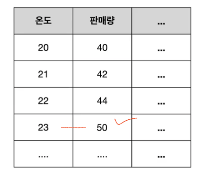
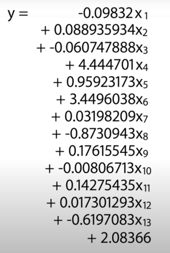
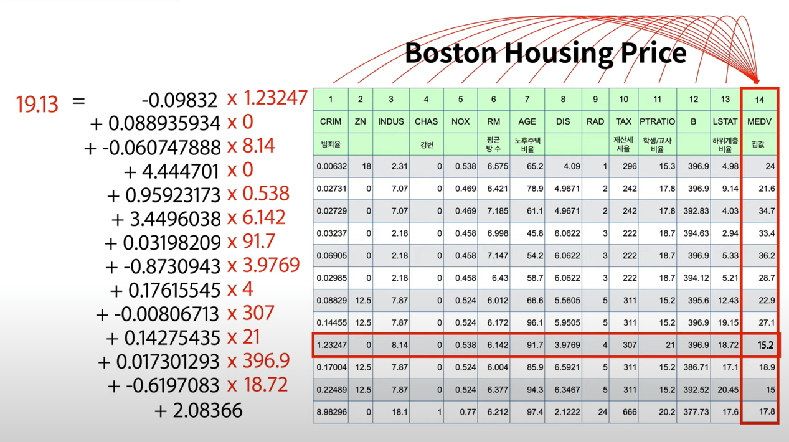
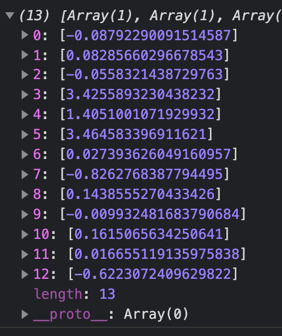

좀 더 현실의 복잡한 문제에 다가가보자.

- 위 사진의 표시된 부분과 같이 오차가 포함된 데이터라면?
- 또는 무수히 많은 컬럼들 (인풋) 을 가진 데이터라면?

이 경우 `y = a * x + b` 의 공식이 아래와 같이 복잡해진다.

예를 들어보자,

아래 사진은 1978년도 Boston 의 506개 town (행) 들의 집값의 중앙값 (MEDV) 과 이에 영향을 줄 수 있는 각 요인들 (input) 의 Data 이다. 

이러한 복잡한 현실 문제에서 각각의 input (column) 들과 output(MEDV) 의 관계를 설명할 수 있는 `weight`, `bias` 를 구하는 것은 결코 쉽지 않은 일이다.

즉, Machine Learning 은 이렇게 현실의 복잡한 데이터를 사용해 모델 공식을 만들어 내는 기술이다.

---

위 Data 로 학습한 model 의 weight 를 자세히 살펴보자. (학습 정보는 [5.js](5.js))

각 Column 의 weight 는 아래의 배열과 같은데,

이를 통해 4번 (CHAS _ 강변) 과 6번 (RM _ 방 개수) 가 집값에 큰 영향을 미친다는 것을 알 수 있다.

