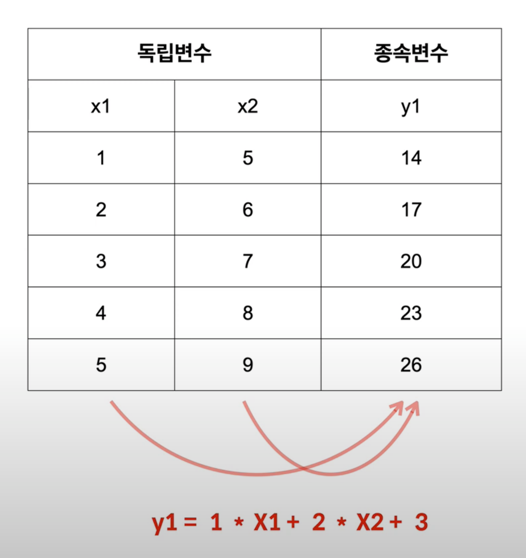
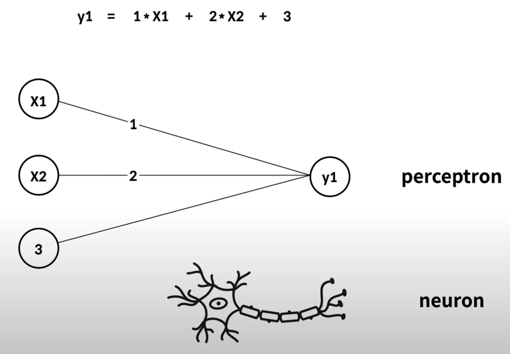
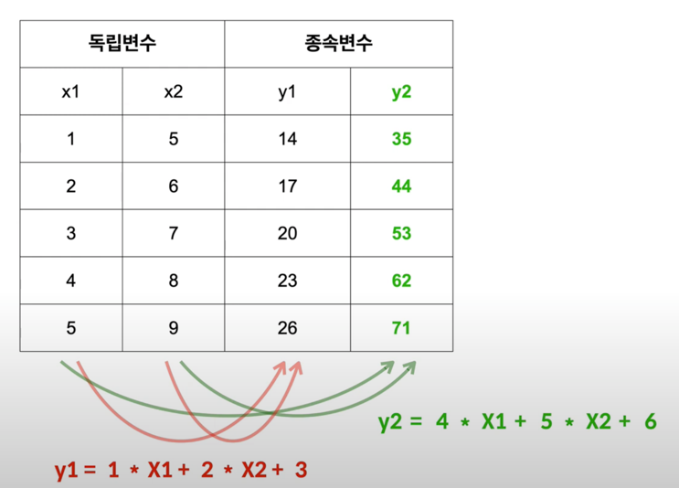
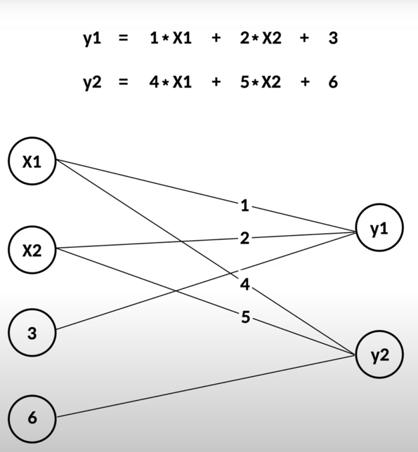
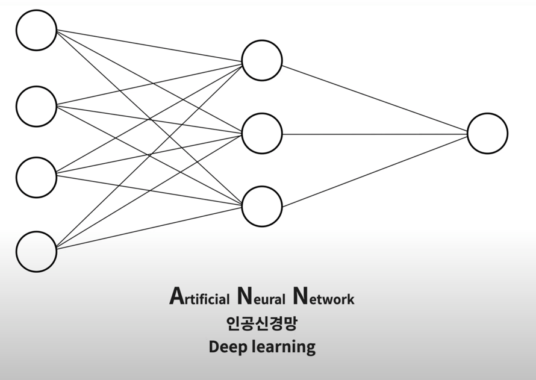
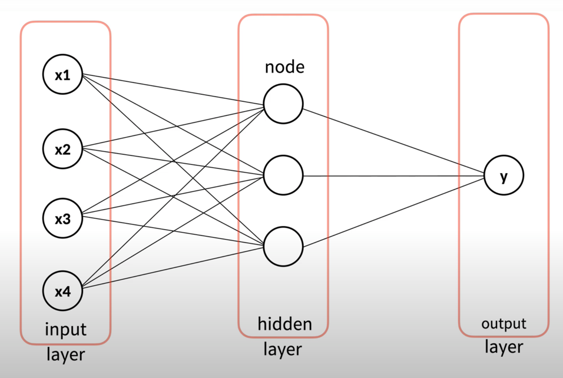

### perceptron 이란

하나의 output 에 대한 weight, bias 관계 단위

(Neural Network 를 이루는 하나의 Neuron 에 해당되는 단위)

**output 이 두개 이상이 되면,**

input , output 의 관계가 더 복잡해진다.

(perceptron 두개 연결)

**Perceptron 을 여러개 연결하면**

더 복잡한 **인공신경망**이 형성된다.

이렇게 Perceptron 을 깊게 연결해서 문제를 해결하는 기술을 Deep Learning 이라고 한다.

하나의 Perceptron 일때보다 훨씬 복잡한 문제를 해결할 수 있게 된다.

- node : 값을 나타내는 하나 하나의 요소
- layer : node 들의 집합
- input layer : model 외부에서 입력을 받는 노드들의 집합
- output layer : model 의 결과를 출력하는 노드들의 집합
- hidden layer : input / output layer 사이에 존재하는, model 외부에서는 볼 수 없는 layer 

[7.html](7.html) 에서 hidden layer 를 추가해 좀 더 model 을 deep learning 답게 바꿔보자.
